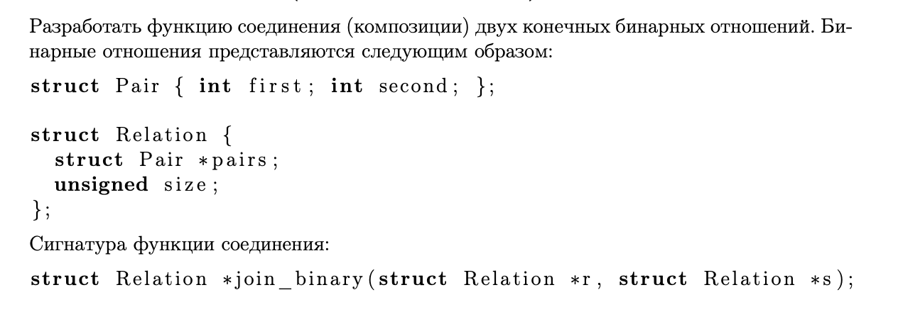

# Discrete-math


<p align="center">
  
</p>

# 
В тестах используется библиотека <check.h>, возможно требуется дополнительная установка.  
Также проект включает отчёт покрытия кода (`gcov/lcov`) и проверку на утечки памяти.  


## 🚀 Запуск и команды

```bash
make all         # сборка и запуск тестов и отчета
make test        # сборка и запуск модульных тестов
make gcov_report # генерация отчёта покрытия исходников тестами
make leaks       # проверка на утечки памяти
make clean       # очистка сборочных файлов и отчётов
